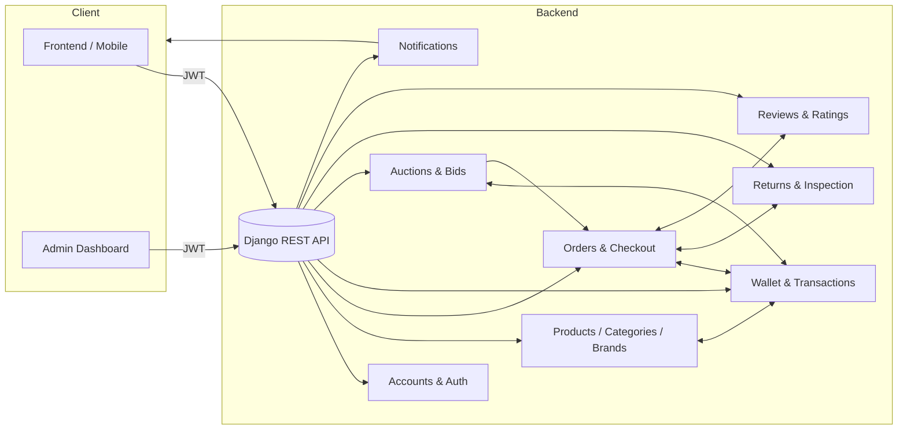

# ECS Store Backend (Single-Vendor Edition)

A high-performance **single-vendor e‑commerce backend** built with **Django + DRF**. This platform is designed for businesses that manage their own inventory directly, removing the complexity of multi-vendor marketplaces while retaining advanced features like auctions, dynamic discounts, and robust returns management.

---

## ✨ Key Features

* **Auth & Roles**: Unified `User` model with `user` (buyer), `admin`, and `superadmin` roles.
* **Catalog Management**: Admin-exclusive product and brand creation. Supports hierarchical categories, high-res images, and standalone discounts.
* **Instant Activation**: Products and Brands are live immediately upon creation—no approval queues for administrators.
* **Cart & Orders**: Atomic checkout with automated stock validation and secure wallet transactions.
* **Wallet System**: Integrated wallet for every user to handle payments, refunds, and auction escrow holds.
* **Auctions**: Admin-curated auctions with real-time bidding, automatic wallet holds, anti-sniping protection, and automated order generation for winners.
* **Returns & Refunds**: Professional return request system with admin inspection and centralized refunding from the platform wallet.
* **Verified Reviews**: Advanced review system allowing 1 review per product per verified purchase, with automated rating aggregation.
* **Notifications**: Integrated notification system for order status updates, auction events, and promotional alerts.

---

## 🧩 Architecture Overview



---

## 📦 Tech Stack

* **Python 3.11+, Django 4.2+, DRF**
* **SQLite** (Development) / PostgreSQL (Production)
* **SimpleJWT** for secure stateless authentication.
* **Mermaid** for architectural documentation.

---

## 🚀 Getting Started

### 1) Environment Setup
```bash
python -m venv .venv
# Windows: .venv\Scripts\activate | Unix: source .venv/bin/activate
pip install -r requirements.txt
cp .env.example .env
```

### 2) Database & Admin
```bash
python manage.py makemigrations
python manage.py migrate
python manage.py createsuperuser
```

### 3) Run Server
```bash
python manage.py runserver
```

---

## 🧭 RESTful API Paths

* **Authentication**: `/api/auth/` (Register, Login, Password Reset)
* **Storefront**: `/api/products/` (Browse catalog, brands, categories)
* **Cart**: `/api/products/cart/` (Manage shopping session)
* **Orders**: `/api/orders/` (Checkout and order history)
* **Auctions**: `/api/auctions/` (Live bidding and scheduling)
* **Admin Analytics**: `/api/analytics-admin/` (Sales reports, inventory health)

---

## 📄 License

MIT

---

## 🙌 Credits

Revised for Single-Vendor Operation. Refactored for efficiency and professional REST standards.
